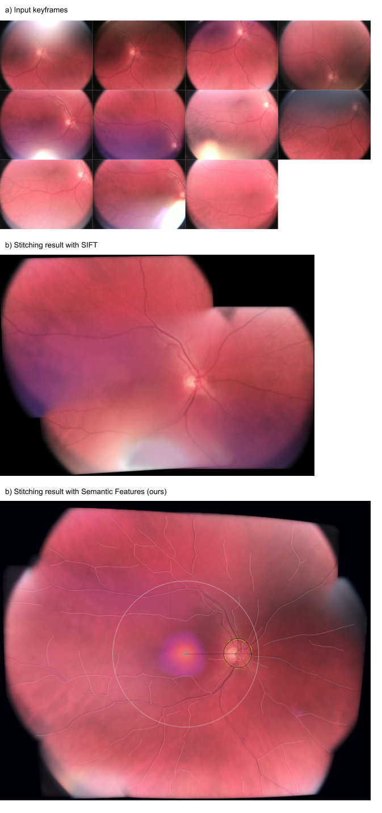

The main product of eye2you: A medical device to examining the retina for different diseases and anatomical anomalies and to be used by non-expert medical personnel. 

Recording and analysis are powered by an artificial intelligence which provides feedback on the quality of the recorded image and the sufficiency of the covered retinal area. 

The recorded images are stitched to a panoramic retina image by taking the anatomical structure of the retina into account. The panoramic image can then be analyzed for specific diseases, anatomical anomalies, or measure anatomical features like cup-to-disc ratio of the optic nerve.

All computations are done on the smartphone using OpenCV, PyTorch, C++ and Kotlin. Models were optimized and ran in real time (<1s per model). 

****

**Example of stitching process**

