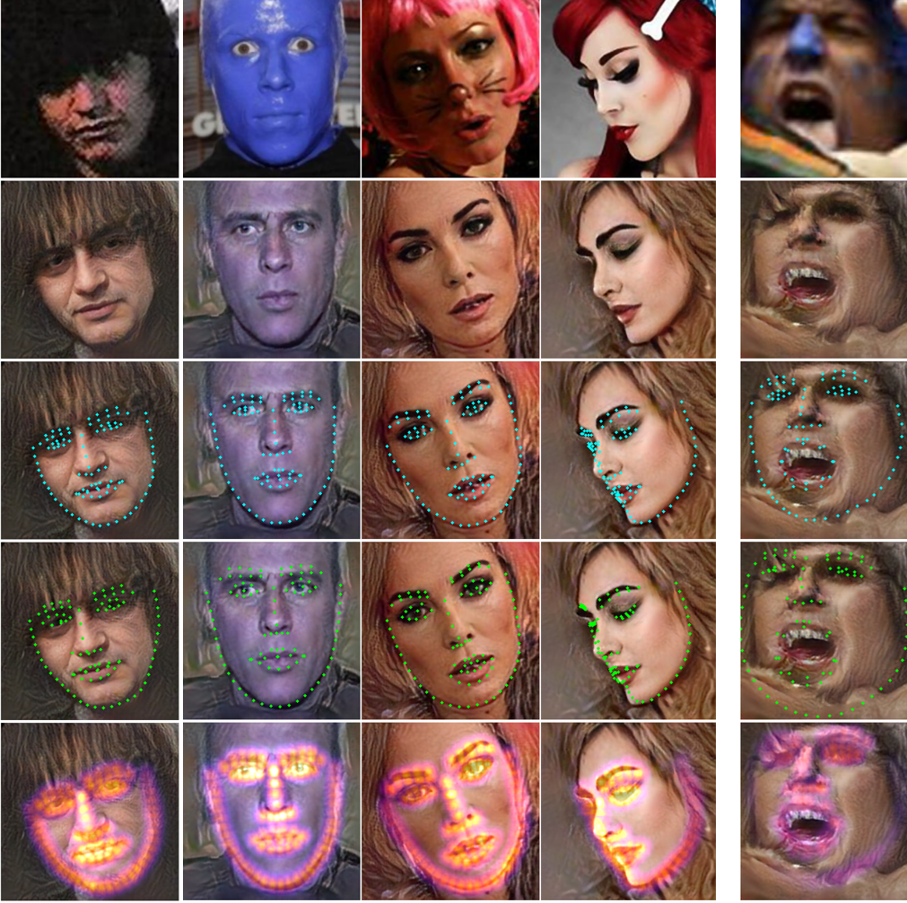

[//]: # (**Summary**)

<video controls autoplay muted>
  <source src="8601-1min.mp4" type="video/mp4">
</video>

****

**Conference Talk (5min)**

<video width="320" height="240" controls>
  <source src="8601-oral.mp4" type="video/mp4">
</video>

****

**A few examples**

Rows show the original, and the reconstruction itself, with predicted landmarks, with ground-truth landmarks, and with predicted landmark heatmaps, respectively.

The fifth column illustrates a failure case.

